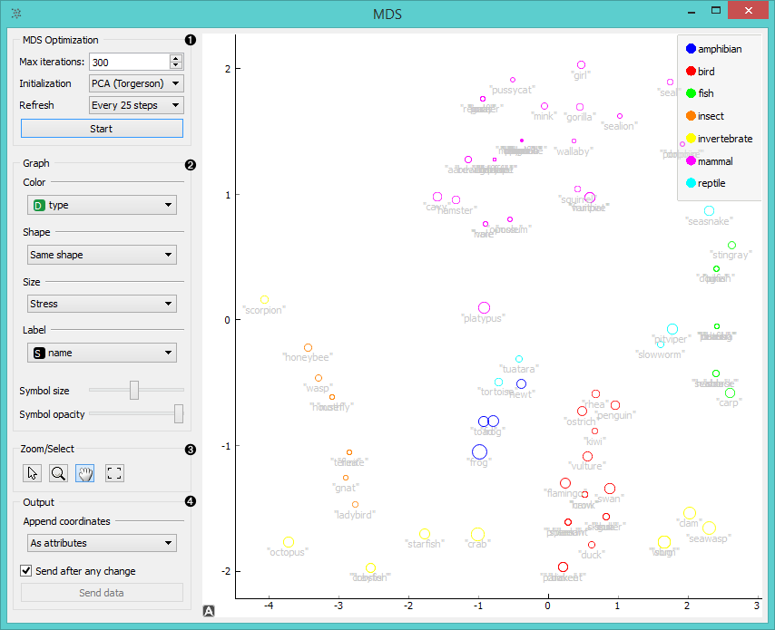
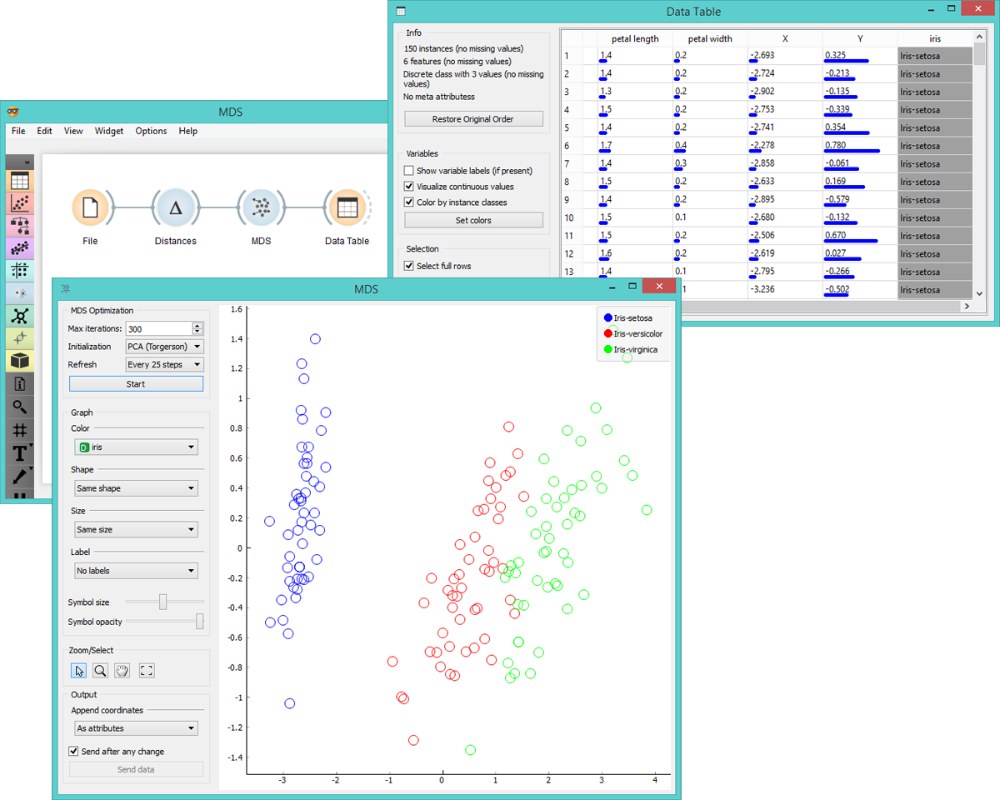

MDS
===

Multidimensional scaling (MDS) projects items onto a plane fitted to the
given distances between points.

Signals
-------

**Inputs**:

- **Distances**

  Distance matrix

- **Data**

  Data set

**Outputs**:

- **Data**

  Data set with MDS coordinates.

- **Data subset**

  Selected data

Description
-----------

[Multidimensional scaling](https://en.wikipedia.org/wiki/Multidimensional_scaling) is a 
technique which finds a low-dimensional
(in our case a two-dimensional) projection of points, where it tries to
fit distances between points as well as possible. The perfect
fit is typically impossible to obtain since the data is high-dimensional or the distances are not 
[Euclidean](https://en.wikipedia.org/wiki/Euclidean_distance).

In the input the widget needs either a data set or a matrix of distances.
When visualizing distances between rows, you can also adjust the color of
the points, change their shape, mark them, and output them upon selection.

The algorithm iteratively moves the points around in a kind of a
simulation of a physical model: if two points are too close to each
other (or too far away), there is a force pushing them apart (or together).
The change of the point’s position at each time interval corresponds to
the sum of forces acting on it.

1. The widget redraws the projection during optimization. Optimization is run automatically in the beginning and later by
   pushing *Start*.
    - **Max iterations**: The optimization stops either when the projection changes only minimally
      at the last iteration or when a maximum number of iterations has been reached.
    - **Initialization**: PCA (Torgerson) positions the initial points along principal coordinate axes. *Random* sets the 
      initial points to a random position and then readjusts them. 
    - **Refresh**: Set how often you want to refresh the visualization. It can be at *Every iteration*, *Every 5/10/25/50  
      steps* or never (*None*). Setting a lower refresh interval makes the animation more visually appealing, but can be slow
      if the number of points is high.
    - *Spread points at zero-distances* allows you to jitter instances with zero distances for better visualization.
2. Defines how the points are visualized. These options are available only when visalizing distances between rows (selected 
   in the **Distances** widget).
    - **Color**: Color of points by attribute (gray for continuous, colored for discrete).
    - **Shape**: Shape of points by attribute (only for discrete).
    - **Size**: Set the size of points (*Same size* or select an attribute)
      or let the size depend on the value of the continuous attribute the point represents (Stress).
    - **Label**: Discrete attributes can serve as a label.
    - **Symbol size**: Adjust the size of the dots.
    - **Symbol opacity**: Adjust the transparency level of the dots.
    - **Show similar pairs**: Adjust the strength of network lines.
3. Adjust the graph with *Zoom/Select*. Arrow enables you to select data instances.
   The magnifying glass enables zooming, which can be also done by scrolling in and out. Hand allows you to move the graph 
   around. Rectangle readjusts the graph proportionally.
4. Select the desired output:
    - **Original features only** (input data set)
    - **Coordinates only** (MDS coordinates)
    - **Coordinates as features** (input data set + MDS coordinates as regular attributes)
    - **Coordinates as meta attributes** (input data set + MDS coordinates as meta attributes) 
   Sending the instances can be automatic if *Send after any change* is checked. Alternatively click *Send data*.
5. **Save Graph** allows you to save the graph either as .svg or .png file to your device.

The MDS graph performs many of the functions of the visualizations
widget. It is in many respects similar to the **Scatter Plot**, so we
recommend reading this widget's description as well.

Example
-------

The above graphs were drawn using the following simple schema. Using the **Distances** widget we input the distance matrix
into the **MDS** widget, where we see the *Iris* data displayed in a 2-dimensional plane. We can see the appended coordinates
in the **Data Table** widget.

References
----------

Wickelmaier, F. (2003). An Introduction to MDS. Sound Quality Research Unit, Aalborg University. Available [here](https://homepages.uni-tuebingen.de/florian.wickelmaier/pubs/Wickelmaier2003SQRU.pdf).
