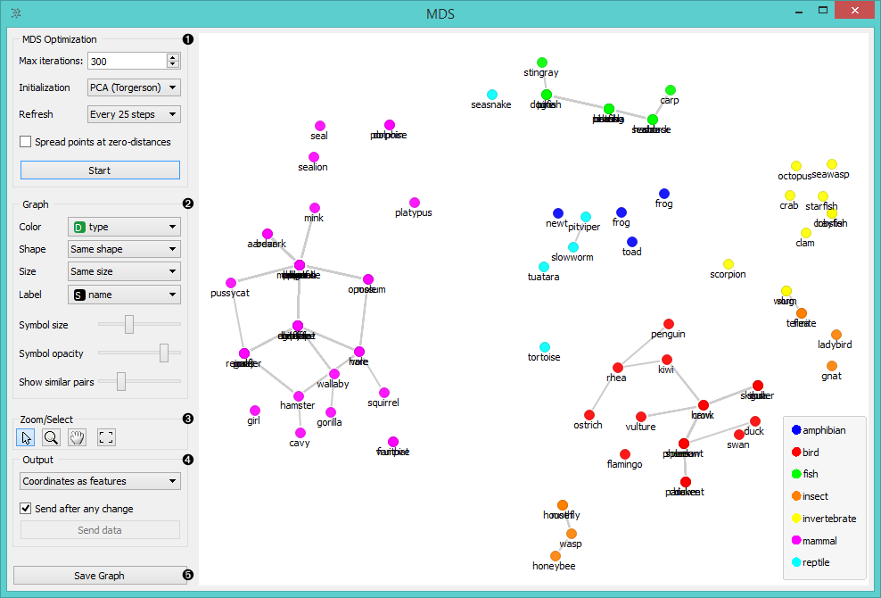
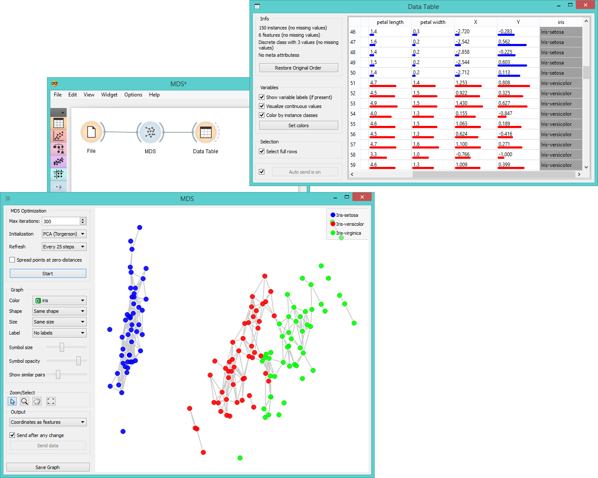

MDS
===

Multidimensional scaling (MDS) projects items onto a plane fitted to the
given distances between points.

Signals
-------

**Inputs**:

- **Distances**

  Distance matrix

- **Data**

  Data set

**Outputs**:

- **Data**

  Data set with MDS coordinates.

- **Data subset**

  Selected data

Description
-----------

[Multidimensional scaling](https://en.wikipedia.org/wiki/Multidimensional_scaling) is a technique which finds a low-dimensional
(in our case a two-dimensional) projection of points, where it tries to
fit the given distances between points as well as possible. The perfect
fit is typically impossible to obtain since the data is high-dimensional or the distances are not Euclidean.

In the input the widget needs either a data set or a matrix of distances.
When visualizing distances between rows, you can also adjust the color of
the points, change their shape, mark them, and output them upon selection.

The algorithm iteratively moves the points around in a kind of a
simulation of a physical model: if two points are too close to each
other (or too far away), there is a force pushing them apart (or together).
The change of the point’s position at each time interval corresponds to
the sum of forces acting on it.

1. The widget redraws the projection during optimization. Optimization is run automatically in the beginning and later by pushing *Start*.
    - **Max iterations**: The optimization stops either when the projection changes only minimally
at the last iteration or when a maximum number of iterations has been reached.
    - **Initialization**: Randomize sets them to a random position; the initial positions are also random. Torgerson
positions the points using Torgerson’s method.
    - **Refresh**: It can do so at Every step, Every 10 steps or Every 100 steps. Setting a lower refresh
interval makes the animation more visually appealing, but can be slow if
the number of points is high.
2. Defines how the points are visualized. These options are available only when visalizing distances between rows (selected in the **Distances** widget).
    - **Color**: depends upon values of discrete attributes
    - **Shape**: depends upon values of discrete attributes
    - **Size**: Set the size of points (Size) or let the size depend on the value of some
continuous attribute (Stress) of the instance the point represents.
    - **Label**: Any attribute can serve as a label.
    - **Symbol size**:
    - **Symbol opacity**:
3. Adjust the graph with *Zoom/Select*. Arrow enables you to select data instances.
  The magnifying glass enables zooming, which can be also done by scrolling in and out. Hand allows you to move the graph around. Rectangle readjusts the graph proportionally.
4. Append the coordinates of each point to the data set. They can be appended either
as normal attributes (*As attributes*) or as meta attributes (*As metas*). Select *Do not append* to omit this function.
  Sending the instances can be automatic if *Send after any change* is checked. Alternatively click *Send data*.

The MDS graph performs many of the functions of the visualizations
widget. It is in many respects similar to the **Scatter Plot**, so we
recommend reading its description as well.

Example
-------

The above graphs were drawn using the following simple schema.

