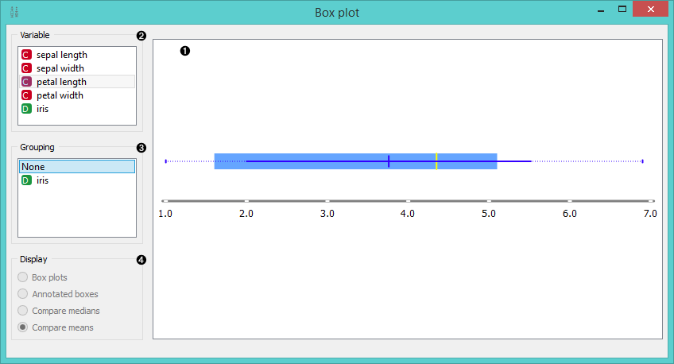
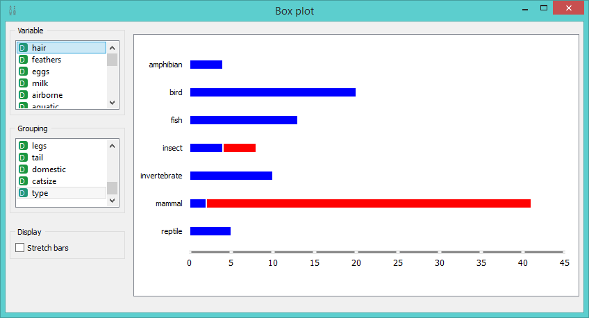

Box Plot
========

Shows basic distribution of attribute values.

Signals
-------

**Inputs**:

- **Data**

  Input data set.

**Outputs**:

- (None)

Description
-----------

**Box Plot** shows distributions of attribute values. It is a
good practice to check any new data with this widget to quickly
discover any anomalies, such as duplicated values (e.g. gray and grey),
outliers, and alike.

For continuous attributes, the widget shows the minimal and maximal
value. In case of Iris’s attribute '*petal length*' (figure on the left),
these are 1.6 and 5.1 (approximately). The mean (dark blue)
and the median (yellow) are represented by the vertical line.

Choose *Grouping* to see box plots displayed by class. When instances are grouped by class
you can change the display mode. Annotated boxes will display the end values, the mean and the median,
while compare medians and compare means will, naturally, compare the selected value between class groups.

1. Visual representation of the data file
2. Variable presented
3. Choose grouping by class
4. Choose display mode

For discrete attributes, the bars represent the number of examples with
each particular attribute value. The picture shows the number of
different animal types in the *Zoo* data set: there are 41 mammals, 13
fish, 20 birds and so on.

Example
-------

**Box Plot** is most commonly used immediately after the **File**
widget to observe statistical properties of the data set. It is also
useful for finding properties of a specific data set, for instance a
group of examples manually defined in another widget (e.g. **Scatterplot**) 
or examples belonging to some cluster or a classification tree
node, as shown in the schema below.

