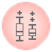
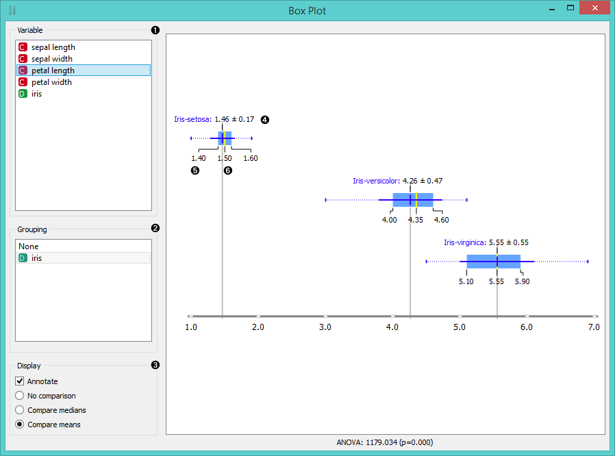
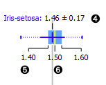
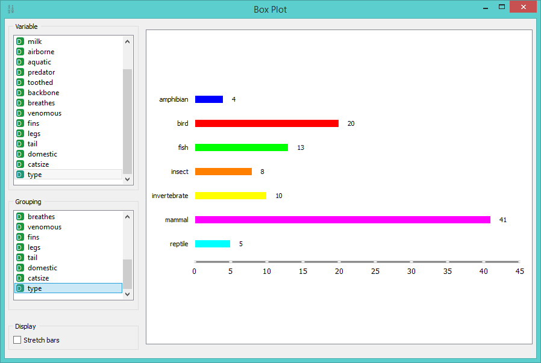
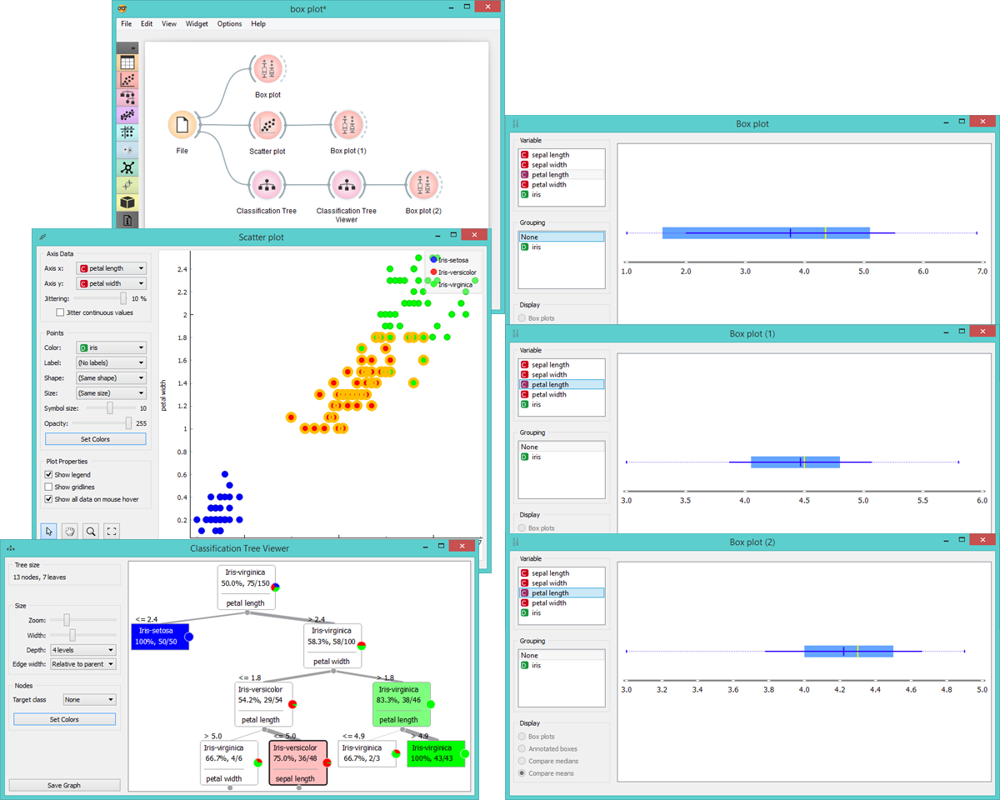

Box Plot
========

Shows distribution of attribute values.

Signals
-------

**Inputs**:

- **Data**

  Input data set.

**Outputs**:

- (None)

Description
-----------

**Box Plot** shows distributions of attribute values. It is a
good practice to check any new data with this widget to quickly
discover any anomalies, such as duplicated values (e.g. gray and grey),
outliers, and alike.

1. Select the variable you want to see plotted.

2. Choose *Grouping* to see [box plots](https://en.wikipedia.org/wiki/Box_plot) displayed by class.

3. When instances are grouped by class you can change the display mode.
   Annotated boxes will display the end values, the mean and the median,
   while compare medians and compare means will, naturally, compare the 
   selected value between class groups.

   

   For continuous attributes the widget displays:

4. The mean (dark blue vertical line). 

5. Border values for the 
   [standard deviation of the mean](https://en.wikipedia.org/wiki/Standard_deviation#Standard_deviation_of_the_mean).
   Blue highlighted area is the entire standard deviation of the mean.

6. The median (yellow vertical line).
  
   The thin blue line represents the area between the first (25%) and the third (75%) quantile,
   while the thin dotted line represents the entire range of values (from the lowest to the highest value
   in the data set for the selected parameter).

For discrete attributes, the bars represent the number of instances with
each particular attribute value. The plot shows the number of
different animal types in the *Zoo* data set: there are 41 mammals, 13
fish, 20 birds and so on.

Example
-------

**Box Plot** is most commonly used immediately after the **File**
widget to observe statistical properties of the data set. It is also
useful for finding properties of a specific data set, for instance a
set of instances manually defined in another widget (e.g. **Scatterplot**) 
or instances belonging to some cluster or a classification tree
node, as shown in the schema below.

