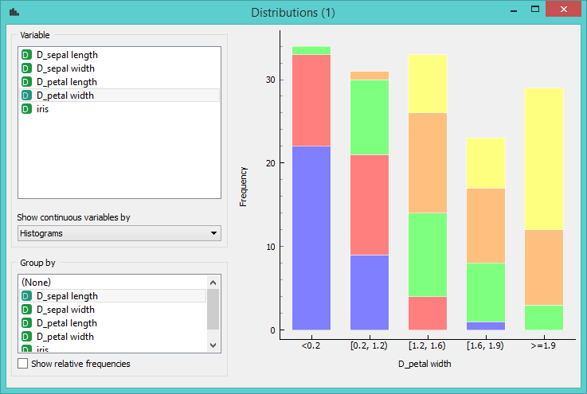

Distributions
=============

Displays value distributions for a single attribute.

Signals
-------

**Inputs**:

- **Data**

  Input data set.

**Outputs**:

- (None)

Description
-----------

**Distributions** displays value distribution of discrete or
continuous attributes. If the data contains class variable, distributions are
conditioned on the class.

For discrete attributes, the graph displayed by the widget shows how
many times (e.g., in how many instances) each attribute
value appears in the data. If the data contains a class variable, class
distributions for each of the attribute values will be displayed as well
(like in the snapshot above). The widget may be requested to display
only value distributions for instances of certain class (*Group by*).

For continuous attributes, the attribute values are discretized and
value distribution is displayed as a histogram. Class
probabilities for the continuous attributes are obtained through loess
smoothing, while the appearance of the curve is set in *Show continuous variables by*.

In class-less domains, the bars are displayed in gray.

