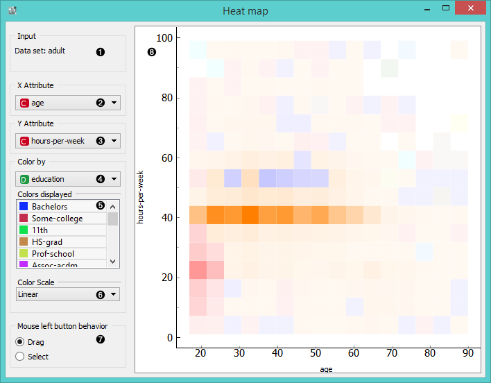
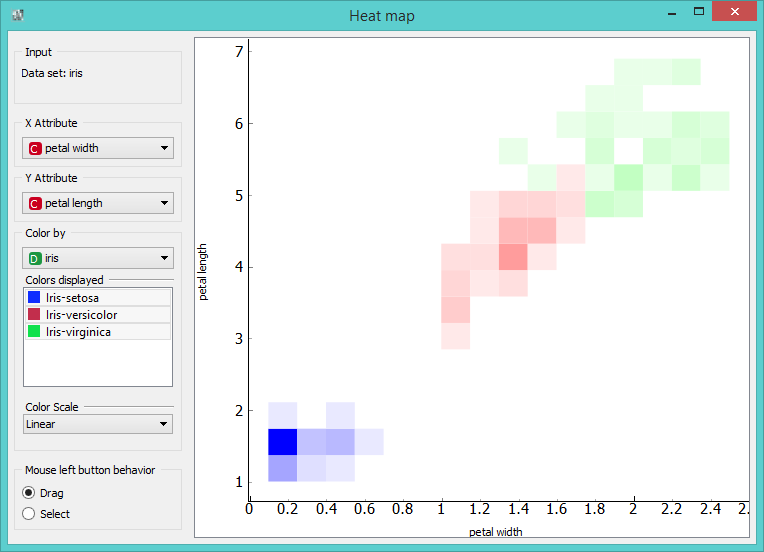

Heat Map
=============

Plots a heat map for a pair of attributes.

Signals
-------

**Inputs**:

- **Data**

  Input data set.

**Outputs**:

- None

Description
-----------

**Heat map** is a graphical method for visualizing frequencies in
a two-way matrix by color. The higher the occurrence of a certain value,
the darker the represented color. By combining two values on x and y axes we see where the attribute
combination is the strongest and where the weakest, thus enabling us to find strong corelations
or representative instances.

1. Information on the input data
2. Choose x attribute
3. Choose y attribute
4. Discrete attribute for color scheme
5. Color scheme legend. You can select which attribute instances you wish to see in the visualization.
6. Select the color scale strength (linear, square root or logarithmic)
7. To move the map use *Drag* and to select data subset use *Select*
8. Visualization

Example
-------

Below you can see an example workflow for Heat Map widget. Notice that the widget only works with continuous
data, so you need to first continuize data attributes that you want to visualize. Heat map below displays two
attributes from *Iris* data set, namely the petal width and petal length. Here we can see the distribution of width and 
length values per Iris type. You can see that the variety *Iris setosa* is distinctly separated from the other two varieties 
by petal width and length and that the most typical values for these attributes is 0.2 for petal width and 1.5 for petal 
length. *Iris virginica* and *Iris versicolor* on the other hand have a greater variance of petal width and length values.

