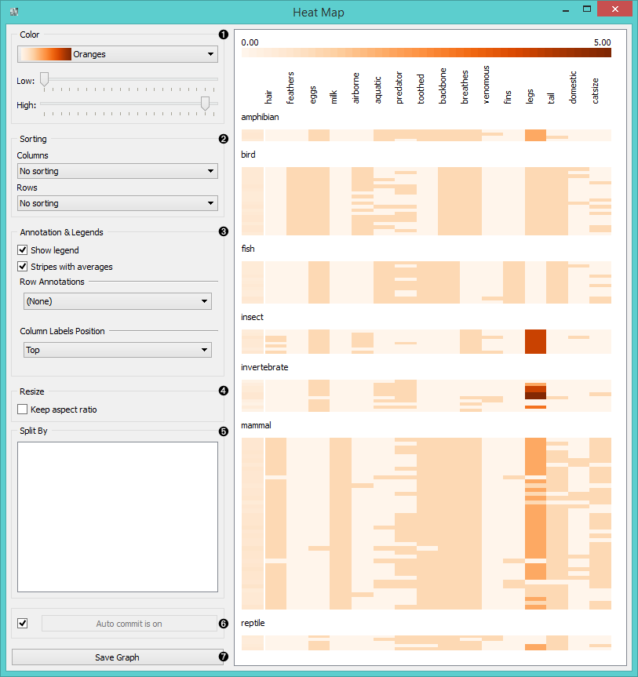
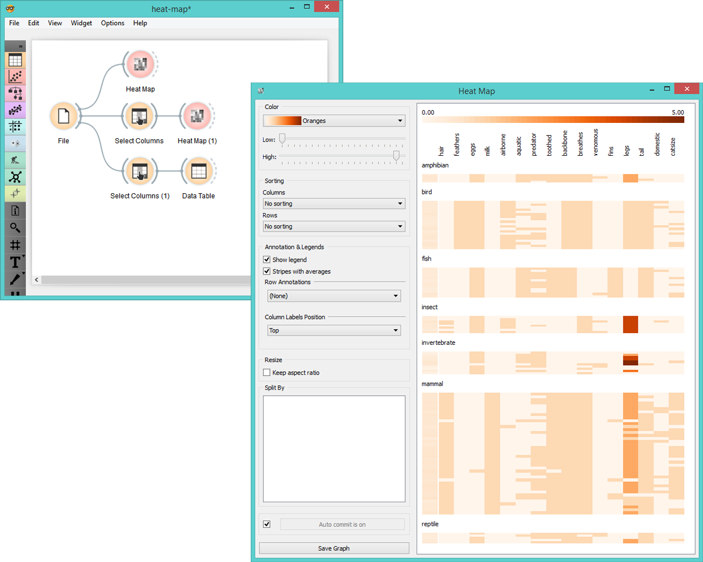
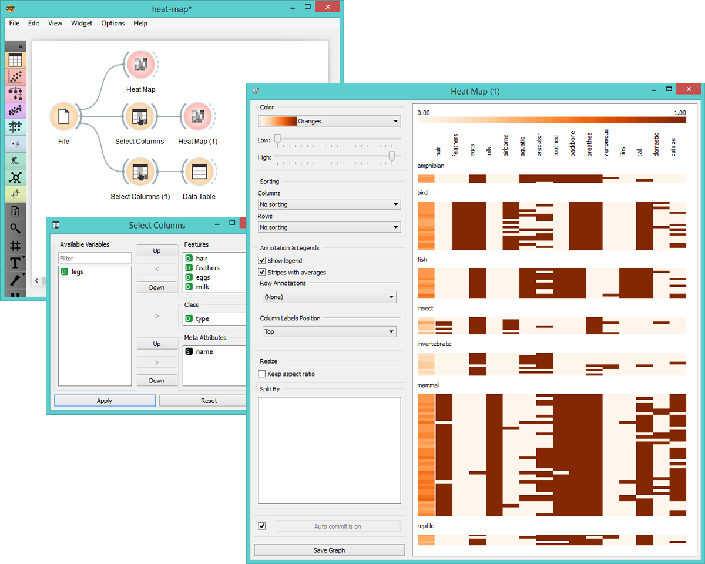
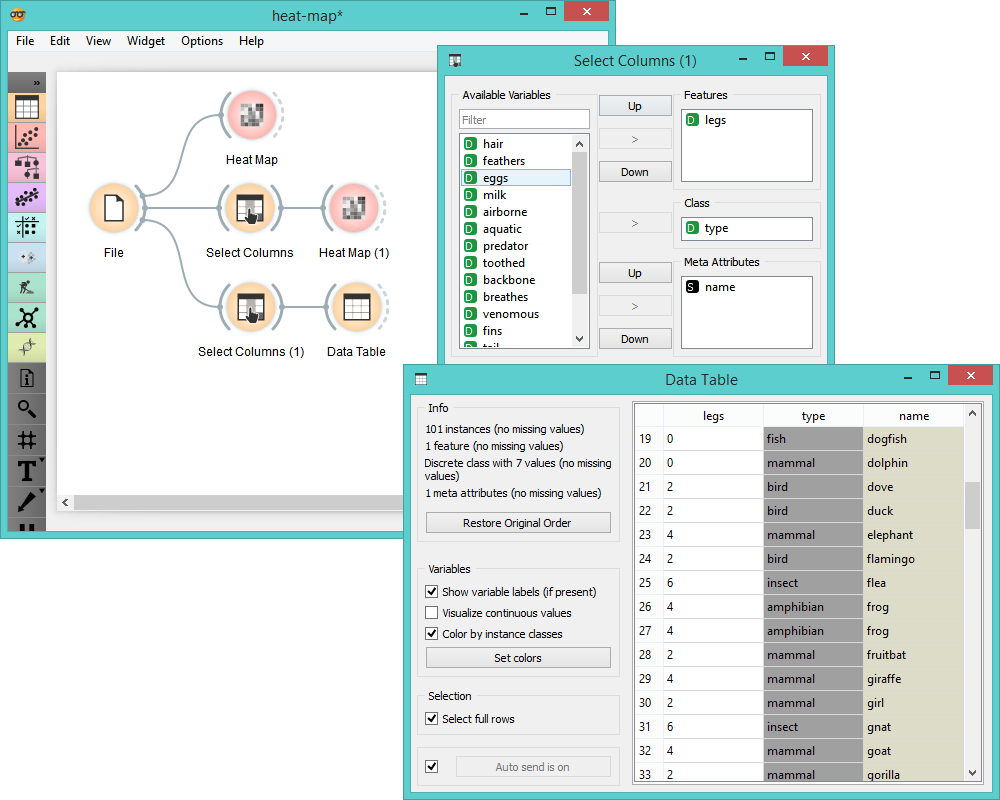

Heat Map
=============

Plots a heat map for a pair of attributes.

Signals
-------

**Inputs**:

- **Data**

  Input data set.

**Outputs**:

- None

Description
-----------

[**Heat map**](https://en.wikipedia.org/wiki/Heat_map) is a graphical method for visualizing attribute values
by class in a two-way matrix. Values are represented by color: the higher a certain value is,
the darker the represented color. By combining class and attributes on x and y axes we see where the attribute
values are the strongest and where the weakest, thus enabling us to find typical features (discrete) or value range 
(continuous) for each class.

1. Color scheme legend. **Low** and **High** are thresholds for the color palette
   (low for attributes with low values and high for attributes with high values).
2. Sort columns and rows:
   - **No Sorting** (lists attributes as found in the data set)
   - **Clustering** (clusters data by similarity)
   - **Clustering with ordered leaves** (maximizes the sum of similarities of adjacent elements)
3. Set what is displayed in the plot in **Annotation & Legend**.
   - If *Show legend* is ticked, a color chart will be displayed above the map.
   - If *Stripes with averages* is ticked, a new line with attribute averages will be displayed on the left.
   - **Row Annotations** adds annotations to each instance on the right.
   - **Column Label Positions** places column labels in a selected place (None, Top, Bottom, Top and Bottom).
4. If *Keep aspect ratio* is ticked, each value will be displayed with a square (proportionate to the map).
5. Split the map by labels, if present in the input.
6. If *Auto commit is on*, changes are communicated automatically. Alternatively press *Commit*.
7. *Save graph* saves the graph to the user's computer in a .svg or .png format.

Example
-------

Below you can see an example workflow for Heat Map widget. Heat map below displays attribute values
for *Zoo* data set (0 is white, 1 is light blue, >1 is dark blue). The first thing we see in the map is
'legs' attribute which is the only one colored in dark blue. In order to get a clearer heat map,
we then use **Select Columns** widget and remove 'legs' attribute from the data set. Then we again
feed the data to the **Heat Map**.

The new projections is much clearer. By removing 'legs' we get a neat visualization of attribute
values for each class. We see that mammals typically have hair, teeth, backbone and milk, while birds
have feathers, eggs and a tail.

Additionally we would like to see why 'legs' attribute was so pronounced in the first heat map.
We again use **Select Columns** widget to feed only this attribute into the **Data Table**. We already
see that this attribute has values different than 0 or 1 - animal either have 2 or 4 legs or none at all.
But as there were two classes represented by a very dark blue, namely invertebrates and insects, we wish
to inspect this further. We sort the table by type and look at invertebrates for example. We see that
this class has 0, 4, 5, 6 or even 8 legs, which is why it was a good idea to remove it from the
heat map visualization as an 'outlying' attribute.

