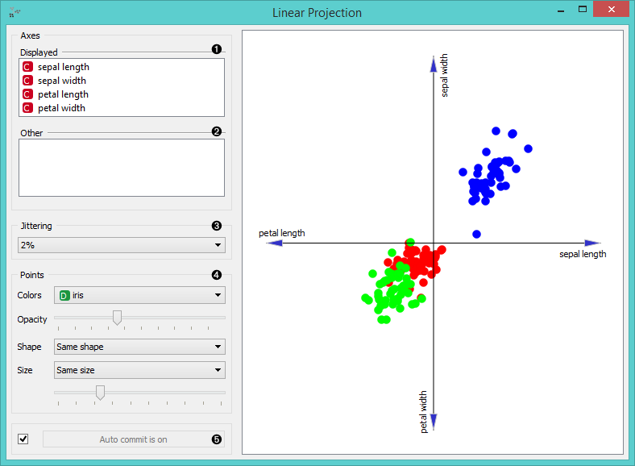
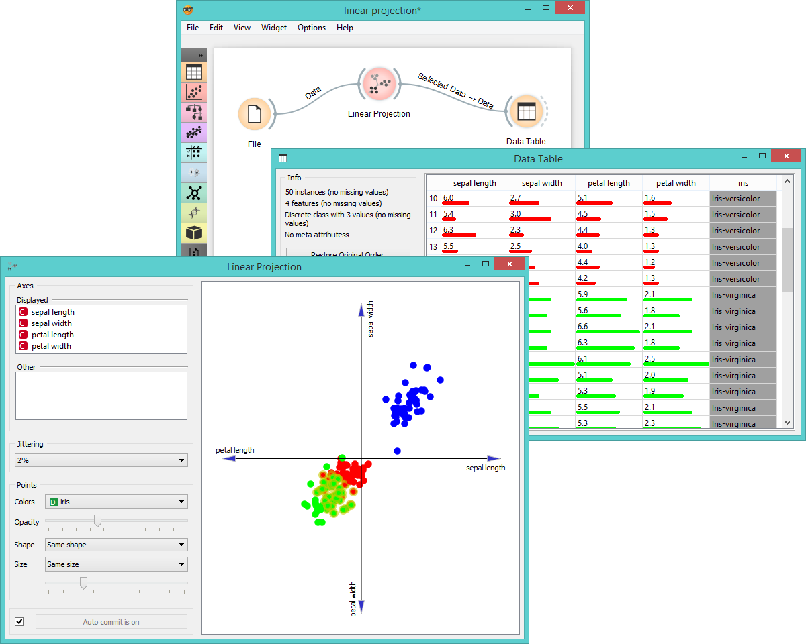

Linear Projection
=================

A linear projection method with explorative data analysis.

Signals
-------

**Inputs**:

- **Data**

  Input data set.

- **Data Subset**

  A subset of data instances.

**Outputs**:

- **Selected Data**

  A data subset that user has manually selected in the projection.

Description
-----------

This widget displays [linear projections](https://en.wikipedia.org/wiki/Projection_(linear_algebra))
of class-labeled data. Consider, for a start, a projection of an *Iris* data set shown below. Notice that it is
sepal width and sepal length that already separates *Iris setosa* from the other two,
while petal width and petal length are the two attributes best separating *Iris versicolor* from *Iris virginica*.

1. Axes in the projection that are displayed.
2. Other available axes.
3. Set [jittering](https://en.wikipedia.org/wiki/Jitter) to prevent dots overlapping (especially for discrete attributes).
4. Set color of the points displayed (you will get colors for discrete values and grey-scale points for continuous). Set opacity, shape and size to differentiate between points.
5. When the box is ticked (*Auto commit is on*), the widget will communicate changes automatically.

Like other point-based visualization widget, **Linear Projection** also allows manual selection of data instances and
zooming. Click and draw instances (works as a non-angular/free-hand
selection tool). Double click to move the projection. Scroll in or out for zoom.

Example
-------

**Linear Projection** works just like other visualization widgets. Below we connected it to the **File** widget to
input the data and see the set projected on a 2-D plane. Then we selected the data for further analysis and
connected it to **Data Table** widget to see the details of the selected subset.

References
----------

Koren Y., Carmel L. (2003). Visualization of labeled data using linear transformations. In Proceedings of IEEE Information Visualization 2003, (InfoVis'03). Available [here](http://citeseerx.ist.psu.edu/viewdoc/download;jsessionid=3DDF0DB68D8AB9949820A19B0344C1F3?doi=10.1.1.13.8657&rep=rep1&type=pdf).

Boulesteix A.-L., Strimmer K. (2006). Partial least squares: a versatile tool for the analysis of high-dimensional genomic data. Briefings in Bioinformatics, 8(1), 32-44. Abstract [here](http://bib.oxfordjournals.org/content/8/1/32.abstract).
