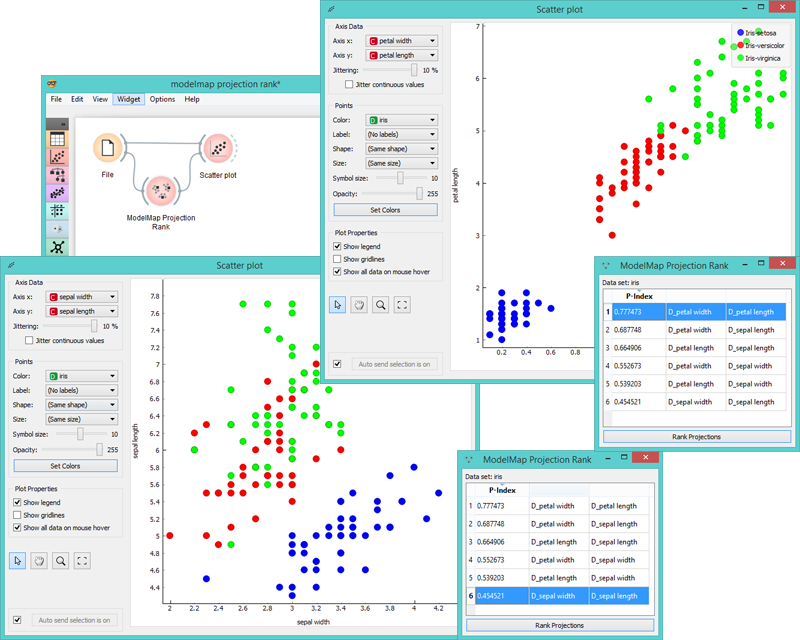

ModelMap Projection Rank
=============

Ranks projection quality for the data set.

Signals
-------

**Inputs**:

- **Data**

  Input data set.

**Outputs**:

- **Features**

  Feature combination of the chosen projection.

Description
-----------

**ModelMap Projection Rank** is an approach, which can automatically find the 
most useful data projections (projections where clusters with different class values are well separated and non
-overlapping). It can be used with visualization methods that map attribute values to points in a two-
dimensional space, namely Sieve Diagram and Scatterplot. 

Interestingness of a projection is estimated as classification accuracy of k-nearest neighbor classifier 
on a data set that consists of positions of the projected points and their class information. Therefore, projections with 
well separated classes will be associated with high classification accuracy while projections with overlapping classes will 
score lower. **ModelMap Projection Rank** can assess all possible projections and presents a short 
list of best scored projections, that will hopefully reveal relevant patterns.

1. Input data information
2. P-index is the value of projection quality. Rank by P-index to see the highest projection quality pairs.
3. Attribute combination with the highest projection quality.
4. Press "*Rank Projections*" to begin the ranking process.

Example
-------

**ModelMap Projection Rank** helps us find the most useful attribute pairs and sends them to visualization widgets. In the 
example below we used *Iris* data set to rank attribute pairs. Click on *P-Index* to sort the data by projection quality. If 
we select the lowest-scoring pair (sepal width and sepal length, see widgets on the left), the scatterplot visualization is 
highly dispersed, thus making it difficult to analyze the data. However, if we select the highest-scoring pair (petal width 
and petal length, see widgets on the right), we can already recognize patterns from the scatterplot visualization (Iris' 
subvarieties are in separate clusters).

References
----------

Leban, G., Zupan, B., Vidmar, G., Bratko, I. (2006). VizRank: Data Visualization Guided by Machine Learning. In Data Mining
and Knowledge Discovery, 13, 119–136. (Available [here](http://eprints.fri.uni-lj.si/210/2/1._G._Leban,_B._Zupan,_G._Vidmar,_I._Bratko,_Data_Mining_and_Knowledge_Discovery_13,_119-36_(2006)..pdf).)
