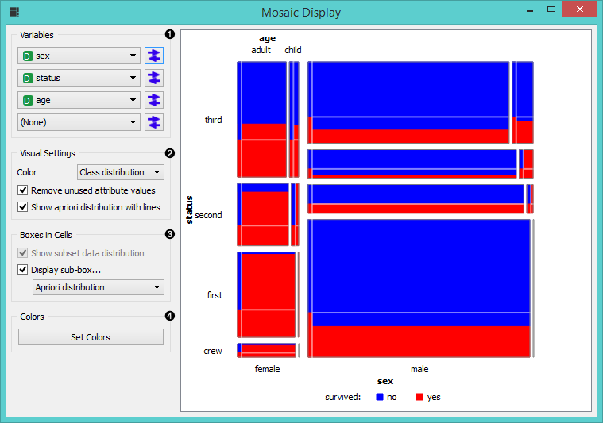
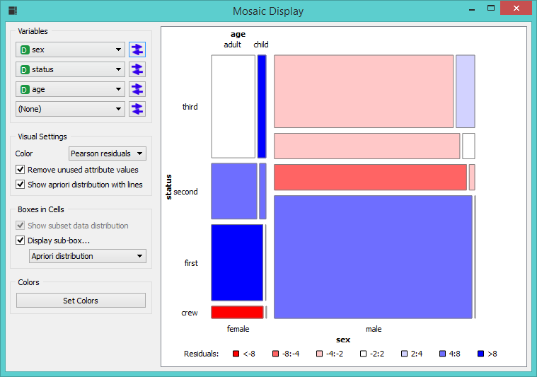

Mosaic Display
==============

Shows a mosaic display of n-way tables.

Signals
-------

**Inputs**:

- **Data**

  Input data set.

- **Data Subset**

  A subset of data instances from data.

- **Selected Data**

  A data subset belonging to manually selected cells in mosaic display.

**Outputs**:

- None

Description
-----------

**Mosaic Display** is a graphical method to visualize the counts in
n-way [contingency tables], that is tables where each cell corresponds
to a distinct value-combination of n attributes. The method was proposed
by Hartigan & Kleiner (HartiganKleiner, 1981) and extended by Friendly
(Friendly, 1994). Each cell in mosaic display corresponds to a single
cell in contingency table. If the data contains a class attribute,
mosaic display will show class distribution.

Orange’s implementation of mosaic display allows to observe
interactions of up to four variables in a single visualization. The
snapshot below shows a mosaic display for the *Titanic* data set,
observing three variables (sex, status, and age) and their association
with a class (survived). The diagram shows that the survival (red color)
was highest for women traveling in the first class, and lowest for men
traveling in the second and third class.

1. Choose variables that you want to present in mosaic display
2. In the dropdown menu next to *Color* you can display either class distribution or pearson residuals. *Remove unused values* is ticked automatically, while you need to select yourself the option to *Show apriori distribution with lines*.
3. Automatically displays apriori distribution
4. Select the color scheme

This visualization is slightly more complex, but once you get used
to it, it is also more informative, provided the expected class distribution is shown in
the same visualization. For this purpose choose
*Show apriori distribution with lines* from the *Visual settings* subbox. 
This would plot a bar on the top of every cell displayed, enabling us to observe the 
difference between the actual and expected distribution for each cell. Change
*Apriori distribution* to *Expected distribution* in the *Boxes in cells* subbox to compare the
actual distributions to those computed by assuming the independence of
attributes.

The degree of deviation from aprori class distribution for each cell can
be directly visualized using *Standard Pearson* residuals option (the dropdown menu in the *Visual settings* subbox).
For *Titanic* data set this visualization clearly shows combinations of
attributes for which the chances of survival were the highest or the lowest.

Instead of comparing cells' class distribution to apriori ones, these
can be compared to the distribution from a subset of instances from the same
data domain. The widget uses a separate input channel for this purpose.
Notice also that individual cells can be selected/de-selected (clicking
with left or right mouse button on the cell), sending out the instances
from the selected cells using the Selected Examples channel.

References
----------

Hartigan, J. A., and Kleiner, B. (1981). Mosaics for contingency tables. In W. F. Eddy (Ed.), Computer Science and Statistics: Proceedings of the 13th Symposium on the Interface. New York: Springer-Verlag.

Friendly, M. (1994). Mosaic displays for multi-way contingency tables. Journal of the American Statistical Asssociation, 89, 190-200.
