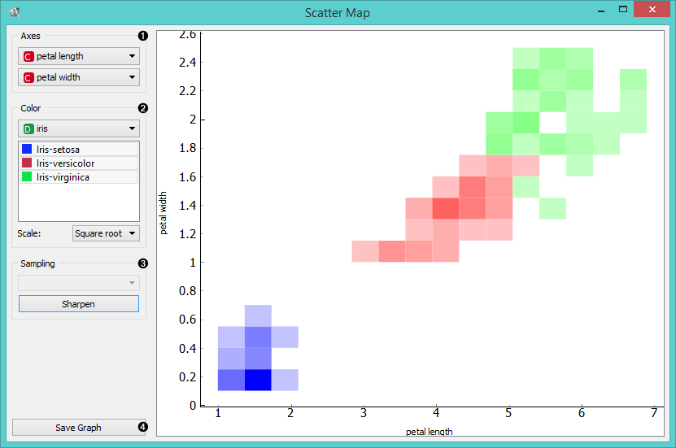
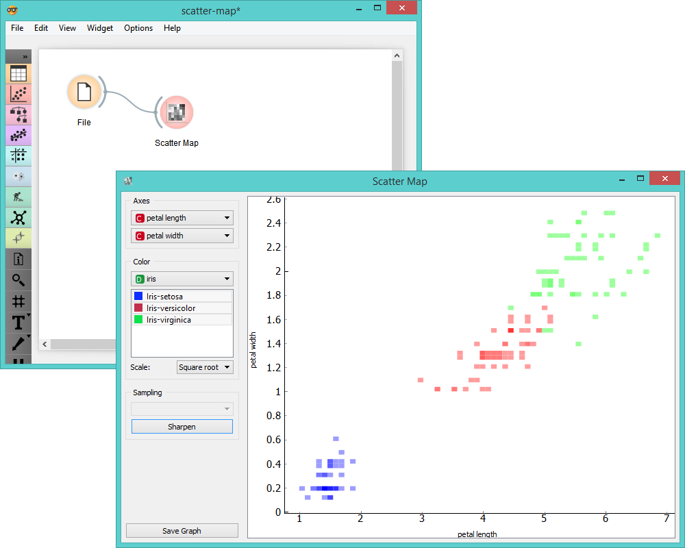

Scatter Map
===========

Plots a scatter map for a pair of continuous attributes.

Signals
-------

**Inputs**:

- **Data**

  Input data set.

**Outputs**:

- None

Description
-----------

[**Scatter map**](https://en.wikipedia.org/wiki/Scatter_plot) is a graphical method for visualizing frequencies in
a two-way matrix by color. The higher the occurrence of a certain value,
the darker the represented color. By combining two values on x and y axes we see where the attribute
combination is the strongest and where the weakest, thus enabling us to find strong corelations
or representative instances.

1. Select x and y attribute.
2. Color the plot by attribute. You can also select which attribute instances you wish to see in the
   visualization by clicking on them. At the bottom you can select the color scale strength 
   ([linear](https://en.wikipedia.org/wiki/Linear_function_(calculus)), 
   [square root](https://en.wikipedia.org/wiki/Square_root) or 
   [logarithmic](https://en.wikipedia.org/wiki/Logarithm#Logarithmic_scale)).
3. *Sampling* is enabled only when the widget is connected to the *SQL Table* widget. You can set the sampling time
   for large data to speed up the analysis. *Sharpen* works for all data types and it will resize (sharpen) the
   squares in the plot.
4. *Save graph* saves the graph to your computer in a .svg or .png format.

Example
-------

Below you can see an example workflow for **Scatter Map** widget. Notice that the widget only works with continuous
data, so you need to first continuize data attributes that you want to visualize. Scatter map below displays two
attributes from *Iris* data set, namely the petal width and petal length. Here we can see the distribution of width and 
length values per Iris type. You can see that the variety *Iris setosa* is distinctly separated from the other two varieties 
by petal width and length and that the most typical values for these attributes are around 0.2 for 
petal width and between 1.4 and 1.7 for petal length. This shows that petal width and length are good attributes for
telling iris setosa apart from the other two varieties.

