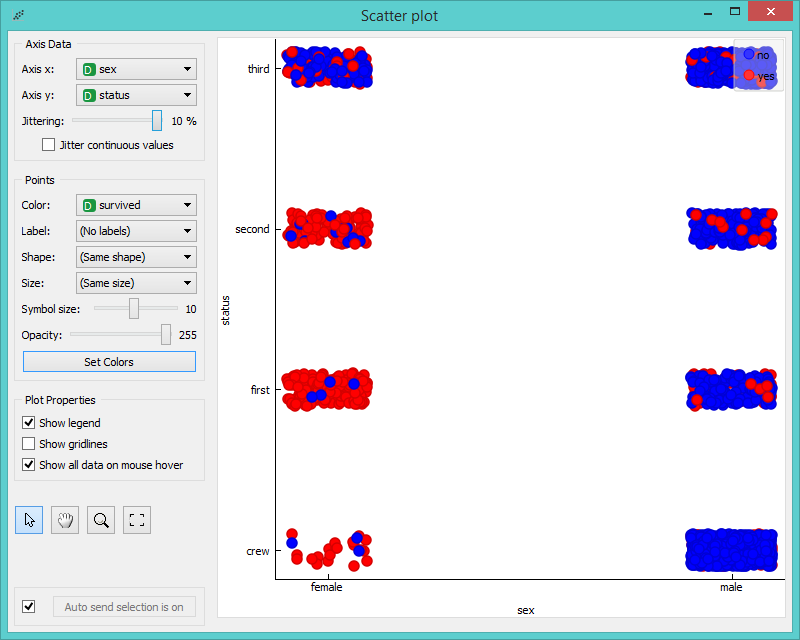

Scatter Plot
============

Scatterplot visualization with explorative analysis and
intelligent data visualization enhancements.

Signals
-------

**Inputs**:

- **Data**

  Input data set.

- **Data Subset**

  A subset of instances from the input data set.

**Outputs**:

- **Selected Data**

  A subset of instances that user has manually selected from the scatterplot.

- **Unselected Data**

  All other data (examples not included in the user’s selection).

Description
-----------

**Scatterplot** widget provides a 2-dimensional scatterplot
visualization for both continuous and discrete-valued attributes. The
data is displayed as a collection of points, each having a value of
X-axis attribute determining the position on the horizontal axis and a
value of Y-axis attribute determining the position on the vertical axis.
Various properties of the graph, like color, size and shape of the
points, axis titles, maximum point size and jittering can be adjusted on the left side of the widget. 
A snapshot below shows a scatterplot of an *Iris* data set, with the size of the points
proportional to the value of sepal width attribute, and coloring matching that of the class attribute.

For discrete attributes, *jittering* circumvents the overlap of the points with the same
value for both axes, and therefore the density of the points in
the region corresponds better to the data. As an example, a
scatterplot for the *Titanic* data set reporting on the gender of the
passengers and the traveling class is shown below; without jittering,
scatterplot would display only eight distinct points.

Intelligent Data Visualization
------------------------------

**Scatterplot** widget works well with other widgets for visualizing data subsets. To find the best projection rank sift the
data through the **ModelMap Projection Rank** widget and select attribute pair with the highest P-value. To see the desired 
data subset in the scatterplot use **Data Table** widget and select a subset manually. **Scatterplot** widget will hollow out
the unselected data and bold the selected data. In **Select Rows** widget you can set the criteria for your subset, which 
filters the input data and makes the scatterplot portray only instances that fit those criteria. You can also use 
**Classification Tree Viewer** widget for selecting the data within a certain tree node.

Explorative Data Analysis
-------------------------

**Scatterplot**, as the rest of Orange widgets, supports zooming-in and out
of the part of the plot and a manual selection of data instances. These functions
are available in the lower left corner of the widget. The default tool is select, which
selects data instances within the chosen rectangular area. Pan enables you to
move the scatterplot around the pane. With 'Zoom' you can zoom in and out of the pane with a
mouse scroll, while 'Reset zoom' resets the visualization to its optimal size. An example of a simple 
schema where we selected data instances from a rectangular region and sent them to the **Data Table**
widget is shown below. Notice that the scatterplot doesn't show all 49 data instances, 
because some data instances overlap (they have the same values for both attributes used).

Example
-------

Scatterplot can be combined with any widget that outputs a list
of selected data instances. In the example below we combine **Classification Tree** 
and **Scatterplot** to display instances taken from a chosen classification tree node
(clicking on any node of classification tree would send a set of
selected data instances to the scatterplot and mark selected instances with filled symbols).

