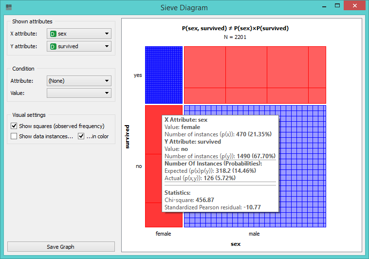
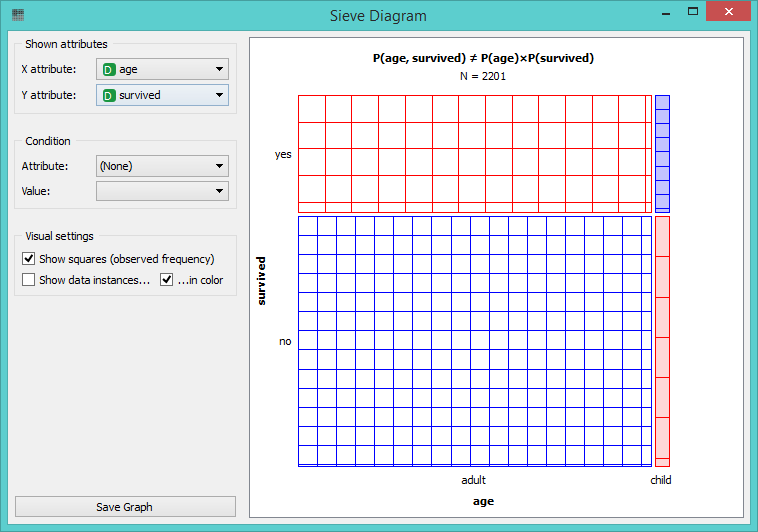

Sieve Diagram
=============

Plots a sieve diagram for a pair of attributes.

Signals
-------

**Inputs**:

- **Data**

  Input data set.

**Outputs**:

- None

Description
-----------

**Sieve diagram** is a graphical method for visualizing frequencies in
a two-way contingency table and comparing them to the expected
frequencies under assumption of independence. The sieve diagram was
proposed by Riedwyl and Schüpbach in a technical report in 1983 and
later called a parquet diagram (Riedwyl and Schüpbach, 1994). In this display the
area of each rectangle is proportional to the expected frequency, while the
observed frequency is shown by the number of squares in each rectangle.
The difference between observed and expected frequency (proportional to
the standard Pearson residual) appears as the density of shading, using
color to indicate whether the deviation from independence is positive
(blue) or negative (red).

The snapshot below shows a sieve diagram for *Titanic* data set and has
attributes *sex* and *survived* (the latter is a class attribute in
this data set). The plot shows that the two variables are highly
associated, as there are substantial differences between observed and
expected frequencies in all of the four quadrants. For example and as
highlighted in a balloon, the chance for surviving the accident was much higher
for female passengers than expected (0.06 vs. 0.15).

Pairs of attributes with interesting associations are shown with shading 
the most interesting attribute pair in the *Titanic* data set, which is
indeed the one we show in the above snapshot. For contrast, a sieve
diagram of the least interesting pair (age vs. survival) is shown below.

References
----------

Riedwyl, H., and Schüpbach, M. (1994). Parquet diagram to plot contingency tables. In Softstat '93: Advances in Statistical Software, F. Faulbaum (Ed.). New York: Gustav Fischer, 293-299.
