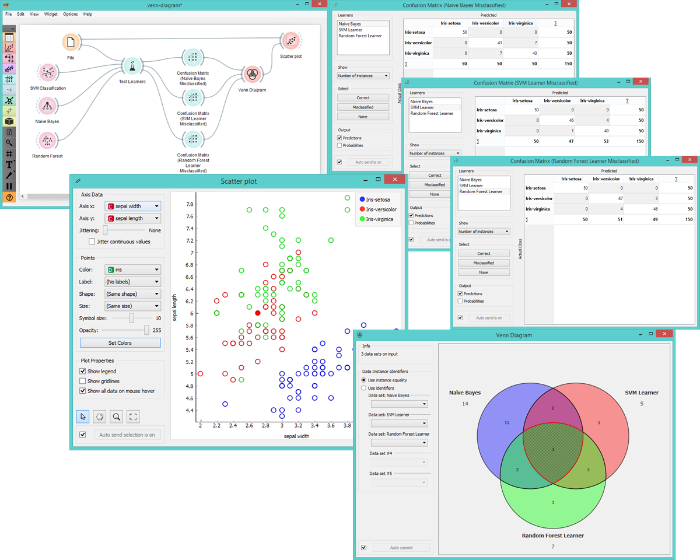

Venn Diagram
=============

Plots [Venn diagram](http://en.wikipedia.org/wiki/Venn_diagram) for two or more data subsets.

Signals
-------

**Inputs**:

- **Data**

  Input data set.

**Outputs**:

- **Data**

  Output data set.

Description
-----------

**Venn Diagram** displays logical relations between data sets. This projection shows two or more data sets represented by 
circles of different colors. Intersections are subsets that belong to more than one data set. To further analyse or visualize
the subset click on an intersection.

1. Venn diagram with input data and number of instances for each data set.
2. Information on input data.
3. Select identifiers by which to compare the subsets.
4. If *Auto commit* is on, changes are automatically communicated to other widgets.

Examples
--------

The easiest way to use **Venn Diagram** is to select data subsets and find matching instances in the visualization. We use 
the *breast-cancer* data set to select two subsets with **Select Rows** widget - the first subset is that of breast cancer 
patients aged between 40 and 49 and the second is that of patients with tumor size between 25 and 29. **Venn Diagram** helps us 
find instances that correspond to both criteria, which can be found in the intersection of the two circles.

**Venn Diagram** widget can be also used for exploring different prediction models. In the following example we analysed 3 
prediction methods, namely *Naive Bayes*, *SVN Learner* and *Random Forest Learner*, according to their misclassified 
instances. By selecting misclassifications in the three **Confusion Matrix** widgets and sending them to Venn diagram, we can
see all the misclassification instances visualized per method used. Then we open **Venn Diagram** and select, for 
example, the misclassified instances that were identified by all three methods (in our case 1). This is represented as an 
intersection of all three circles. Click on the intersection to see this instance marked in the **Scatterplot** widget. Try 
selecting different diagram sections to see how the scatterplot visualization changes.

